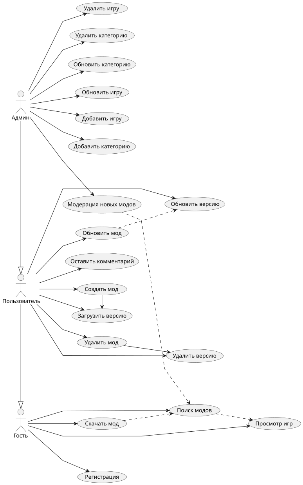
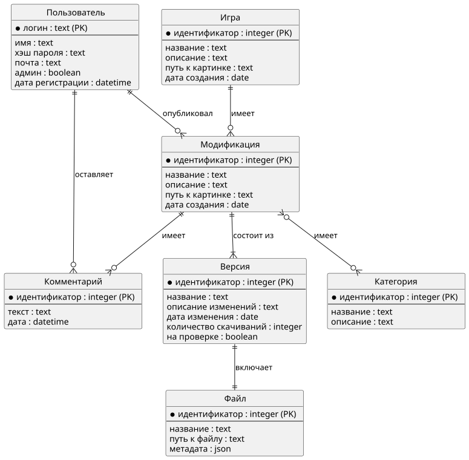
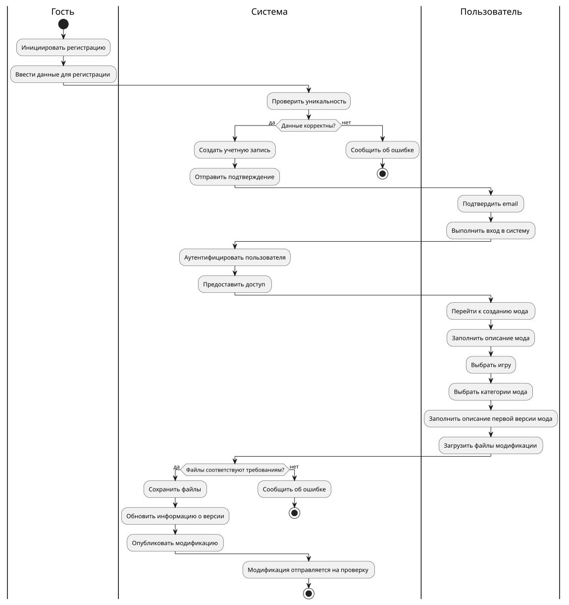

# ModWeave

## Название проекта
ModWeave - платформа игровых модификаций.

## Краткое описание идеи проекта
Веб-платформа для публикации, хранения и распространения пользовательских модов к играм. Пользователи загружают моды с версиями и файлами, оставляют комментарии, скачивают публичные моды.

## Предметная область и сущности
**Предметная область**: платформы моддинга (Modrinth, CurseForge, NexusMods).  
**Основные сущности**:
- **User** – пользователь платформы
- **Game** – игра (Minecraft, Fallout и др.)
- **Mod** – модификация (принадлежит игре и автору)
- **Version** – версия мода с описанием изменений
- **File** – файл принадлежащий какой-то версии мода
- **Comment** – комментарий к моду
- **Category** – категории модов

## Анализ аналогичных решений

| Критерий | Modrinth                | CurseForge         | Nexus Mods       |
|----------|-------------------------|--------------------|------------------|
| Год основания | 2021                    | 2006               | 2001             |
| Основная аудитория | Minecraft/Fabric        | Minecraft/Forge    | Skyrim/Fallout   |
| API | Открытый REST API       | Открытый REST API  | Открытый API     |
| Модерация контента | Автоматическая + ручная | Ручная             | Ручная           |
| Монетизация | Донаты, премиум API     | Реклама, партнерки | Премиум подписка |

## Обоснование актуальности
Моддинг игр растет, но существующие платформы либо закрыты, либо привязаны к играм. Таким образом необходима открытая платформа не привязанная к какой-либо игре.

## Акторы (роли)
1. **Гость** – просмотр модов, скачивание публичных версий
2. **Авторизованный пользователь** – все как гость + публикация модов и комментариев
3. **Админ** – модерация контента; добавление новых категорий, игр

## Use-Case диаграмма

## ER-диаграмма сущностей

## Пользовательские сценарии

Скачивание мода (гость):
1. гость заходит на главную страницу, выбирает игру из каталога;
2. переходит в раздел модов, применяет фильтры (популярность, дата, категория);
3. открывает страницу мода, читает описание, просматривает версии и комментарии;
4. выбирает последнюю версию, нажимает "скачать";
5. получает ссылку на файл, скачивает его напрямую.

Публикация мода (авторизованный пользователь):
1. пользователь нажимает кнопку "опубликовать мод";
2. переходит на страницу создания модификации; выбирает игру из списка; вводит название мода и первой версии, описание; выбирает категории;
3. нажимает кнопку "опубликовать";
4. мод отправляется на проверку.

Проверка модов (админ):
1. админ заходит в админ-панель;
2. жмет кнопку "модификации на проверке";
3. переходит в карточку очередной модификации;
4. проверяет название, описание, файлы;
5. подтверждает или отклоняет опубликованную модификацию.

## BPMN

