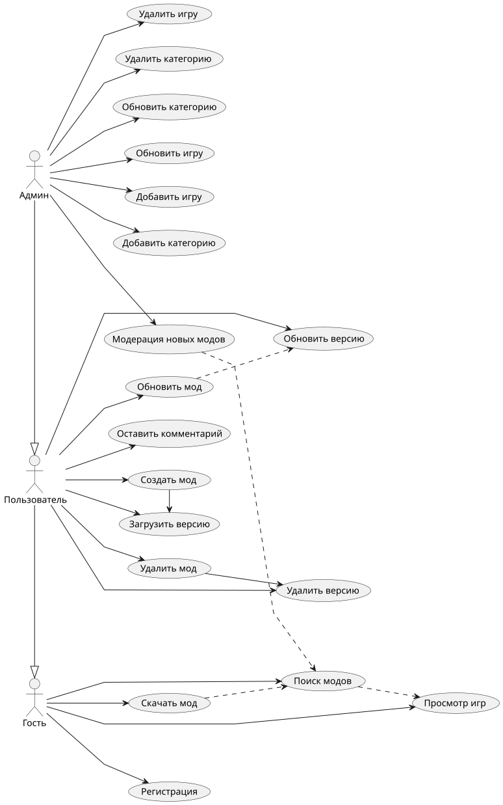
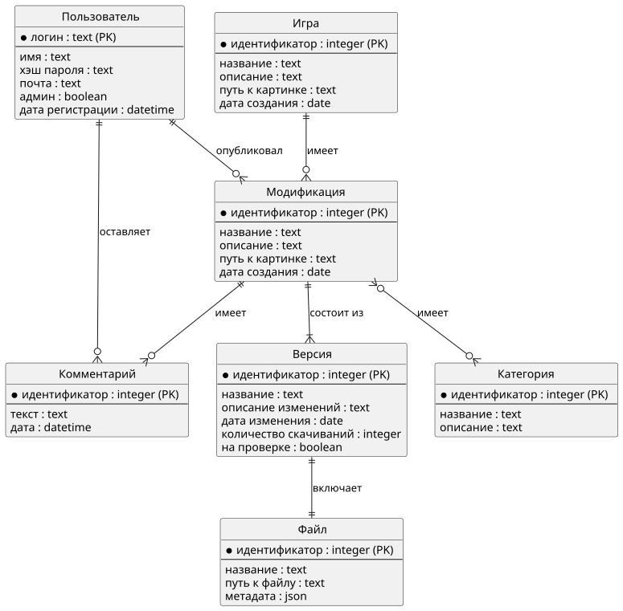
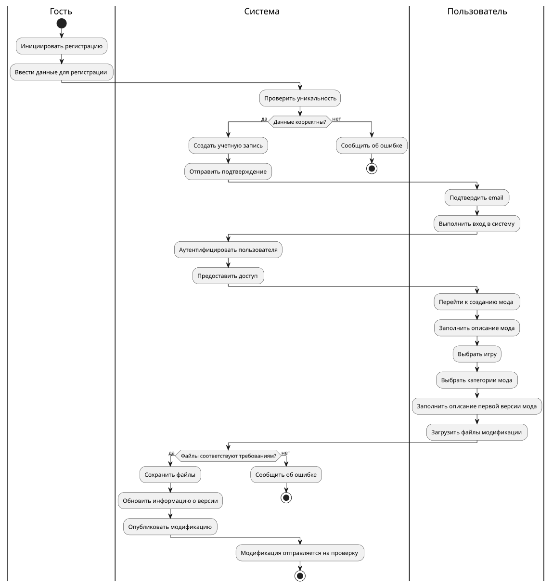

# ModWeave

## Название проекта
ModWeave - платформа игровых модификаций.

## Краткое описание идеи проекта
Веб-платформа для публикации, хранения и распространения пользовательских модов к играм. Пользователи загружают моды с версиями и файлами, оставляют комментарии, скачивают публичные моды.

## Предметная область и сущности
**Предметная область**: платформы моддинга (Modrinth, CurseForge, NexusMods).  
**Основные сущности**:
- **User** – пользователь платформы
- **Game** – игра (Minecraft, Fallout и др.)
- **Mod** – модификация (принадлежит игре и автору)
- **Version** – версия мода с описанием изменений
- **File** – файл принадлежащий какой-то версии мода
- **Comment** – комментарий к моду
- **Category** – категории модов

## Анализ аналогичных решений

| Критерий | Modrinth                | CurseForge         | Nexus Mods       |
|----------|-------------------------|--------------------|------------------|
| Год основания | 2021                    | 2006               | 2001             |
| Основная аудитория | Minecraft/Fabric        | Minecraft/Forge    | Skyrim/Fallout   |
| API | Открытый REST API       | Открытый REST API  | Открытый API     |
| Модерация контента | Автоматическая + ручная | Ручная             | Ручная           |
| Монетизация | Донаты, премиум API     | Реклама, партнерки | Премиум подписка |

## Обоснование актуальности
Моддинг игр растет, но существующие платформы либо закрыты, либо привязаны к играм. Таким образом необходима открытая платформа не привязанная к какой-либо игре.

## Акторы (роли)
1. **Гость** – просмотр модов, скачивание публичных версий
2. **Авторизованный пользователь** – все как гость + публикация модов и комментариев
3. **Админ** – модерация контента; добавление новых категорий, игр

## Use-Case диаграмма



## ER-диаграмма сущностей



## Пользовательские сценарии

Скачивание мода (гость):
1. гость заходит на главную страницу, выбирает игру из каталога;
2. переходит в раздел модов, применяет фильтры (популярность, дата, категория);
3. открывает страницу мода, читает описание, просматривает версии и комментарии;
4. выбирает последнюю версию, нажимает "скачать";
5. получает ссылку на файл, скачивает его напрямую.

Публикация мода (авторизованный пользователь):
1. пользователь нажимает кнопку "опубликовать мод";
2. переходит на страницу создания модификации; выбирает игру из списка; вводит название мода и первой версии, описание; выбирает категории;
3. нажимает кнопку "опубликовать";
4. мод отправляется на проверку.

Проверка модов (админ):
1. админ заходит в админ-панель;
2. жмет кнопку "модификации на проверке";
3. переходит в карточку очередной модификации;
4. проверяет название, описание, файлы;
5. подтверждает или отклоняет опубликованную модификацию.

## BPMN



## Запуск

Нужны JDK 25 и Docker Compose. Из корня проекта:

```sh
docker compose -f docker/docker-compose.yaml up -d
export JWT_SECRET="$(openssl rand -base64 32)"
```

API доступно на `http://localhost:8080/api/v1`. Секрет JWT обязателен; сохраняйте его между перезапусками, чтобы выпущенные токены продолжали работать. Параметры подключения задаются через `DB_URL`, `DB_USER`, `DB_PASSWORD`, `REDIS_HOST`, `REDIS_PORT`, `S3_ENDPOINT`, `S3_ACCESS_KEY`, `S3_SECRET_KEY` и `S3_REGION`. Значения по умолчанию соответствуют локальному SeaweedFS в Compose. Максимальный размер файла — 100 МБ, multipart-запроса — 500 МБ (`spring.servlet.multipart`).

Локальный SeaweedFS запускается вместе с Compose и использует S3 endpoint `http://localhost:8333`. Учетные данные по умолчанию: `username` / `password`; они задаются в `docker/seaweedfs-s3.json`. Приложение автоматически создает бакеты `mods` и `images`, оставляя бакет файлов приватным и делая изображения общедоступными.

```sh
docker compose -f docker/docker-compose.yaml up -d
./gradlew bootRun
```

Compose создаёт схему и триггер при первом запуске PostgreSQL с пустым томом. Источники схемы — `sql/init.sql` и `sql/trigger.sql`; Gradle включает их в ресурсы. Для существующей базы примените `sql/migrate-0.0.1.sql`, затем `sql/trigger.sql`. Уникальные индексы требуют отсутствия дубликатов логинов, email, категорий без учёта регистра и путей файлов. Миграция не удаляет дубликаты автоматически. Ранее настроенные каталоги данных Docker следует перенести в именованные тома перед переходом на обновлённый Compose.

Регистрация и вход принимают `application/x-www-form-urlencoded`; загрузки — `multipart/form-data`. Примеры находятся в `requests/`. Для обновления отображаемого имени используется поле `name`. Ответы версий содержат UUID версии и файлов; скачивание: `GET /api/v1/files/{fileId}/download`. Гостям доступны одобренные версии, автору и администратору — также версии на проверке и отклонённые. Изменять статус может только администратор. Бакет файлов приватный, изображения публичны.

Новый пользователь получает обычные права. Для локальной проверки модерации зарегистрируйте пользователя и назначьте ему `is_admin = true` в `modweave.users`, затем перезапустите приложение с очищенным кэшем `users` и войдите заново. `sql/roles.sql` — отдельный пример ролей PostgreSQL; права API проверяет Spring Security.

## Проверки

```sh
./gradlew test ktfmtCheck
```

Тесты репозиториев запускают изолированный PostgreSQL 16 через Testcontainers. При отсутствии Docker можно выполнить проверки сервисов, JWT, HTTP и метаданных Hibernate:

```sh
./gradlew test --tests 'git.walhay.modweave.regression.*' ktfmtCheck
```

Для отдельной временной PostgreSQL-базы можно заранее применить `sql/init.sql` и `sql/trigger.sql`, затем задать `MODWEAVE_TEST_DATABASE_URL`, `MODWEAVE_TEST_DATABASE_USER`, `MODWEAVE_TEST_DATABASE_PASSWORD`. Используйте только тестовую базу.

Генератор демонстрационных данных: `python3 -m pip install -r seed/requirements.txt`, затем `python3 seed/main.py`. Он использует `DB_HOST`, `DB_PORT`, `DB_NAME`, `DB_USER`, `DB_PASSWORD`; пароль сгенерированных пользователей задаёт `SEED_PASSWORD` (по умолчанию `seed-password`). Пароли сохраняются как BCrypt. Ссылки на файлы в этих данных демонстрационные: генератор не загружает объекты в SeaweedFS.
